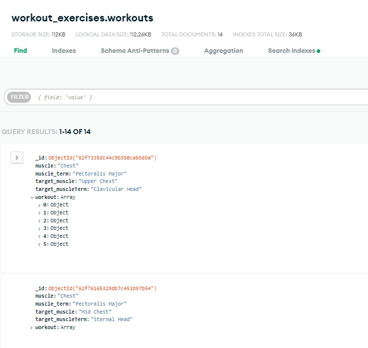
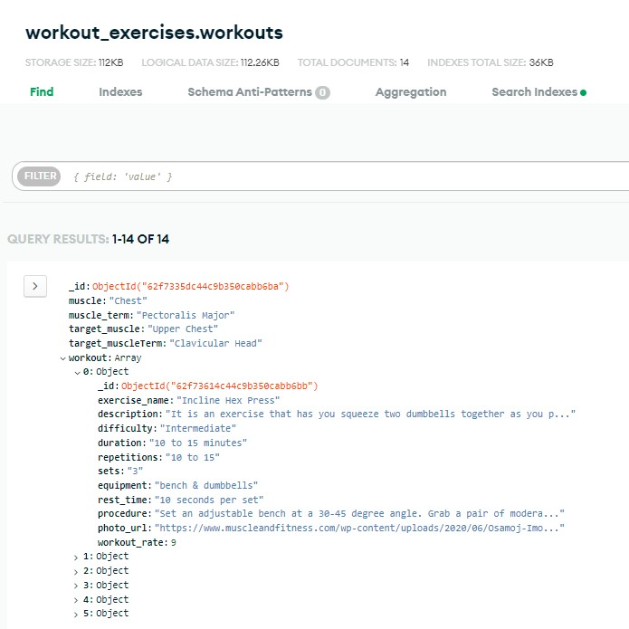
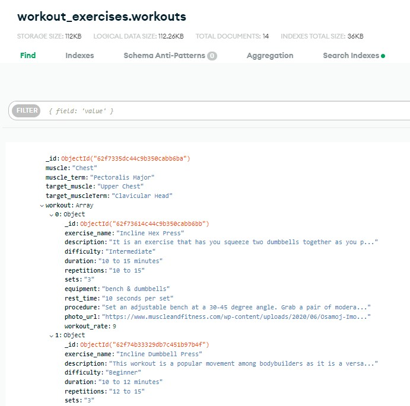
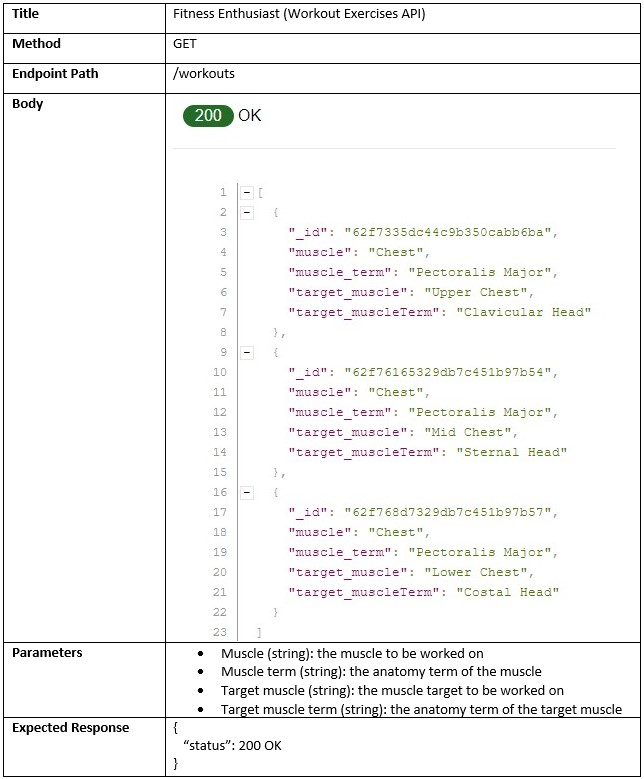
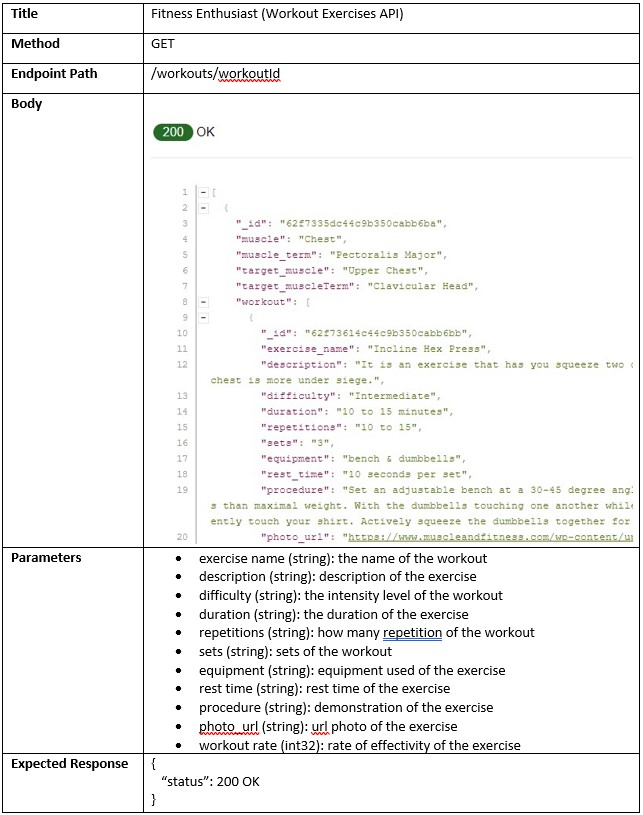
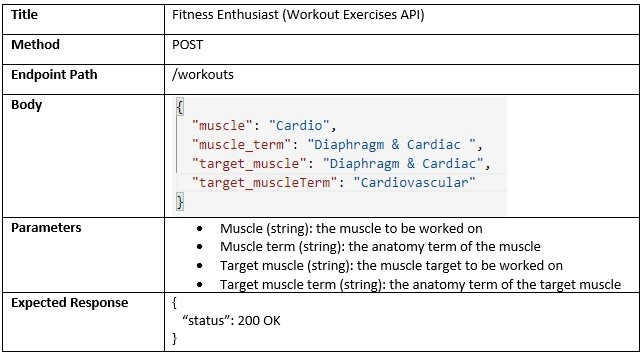
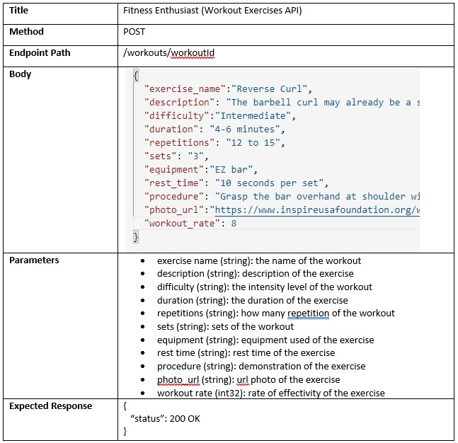

# WorkoutExercises-RestfulAPI

## Project Name and Summary

Fitness Enthusiast is the name of the project. The Project is about workout routines and exercises intended for those users who are passionate in fitness and healthy lifestyle. This project is essential for all the fitness users who are having a hard time to find the right exercises especially if the users are first timers or beginners.

Please click the link to view the project

## Features

Set of API Endpoints of the following:
* For the users to create or register an account
* For the users to login account and obtain JSON web token
* To get all documents and sub-documents
* To get a document by its ID
* To search for documents by criteria
* To post or add a new document and connect it with JWT owner
* To update the existing document and verification of JWT owner
* To delete the existing document and verification of JWT owner

Content:
* List of Exercises for Chest, Shoulder, Back, Biceps, Triceps, Legs, Forearm and Abdominal
* Description of Workout Exercises
* Number of Workouts by its intensity - Beginner, Intermediate and Advanced
* Workout Exercises with step-by-step demonstration or procedure

## Sample Mongo Documents

 
 
 

## API Documentation

 
 
 
 

## Testing

## Credits

#### [Google](https://www.google.com/)
    - The main source of the content of the project. This is where the documents gathered from such as workout exercises, routines and workout procedure or demonstration. 

#### Website Source Links
    - These website links contributes a huge help to build the content of this project. Below are the website source links.

#### All application/software used in this project

* [Gitpod](https://gitpod.io/)
* [Advanced REST Client](https://github.com/advanced-rest-client/arc-electron)
* [MongoDB](https://account.mongodb.com/)
* [GitHub]((https://github.com/)

#### All TAs during consultation day & to Mr. Paul Chor for an amazing lecture