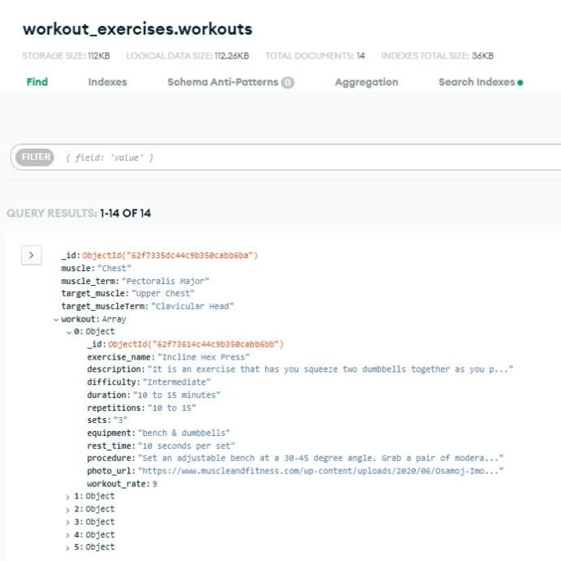

# WorkoutExercises-RestfulAPI

## Project Name and Summary

Fitness Enthusiast is the name of the project. The Project is about workout routines and exercises intended for those users who are passionate in fitness and healthy lifestyle. This project is essential for all the fitness users who are having a hard time to find the right exercises especially if the users are first timers or beginners.

Please click the link to view the project

## Features

RestFUL API for Workout Exercises:
* API documents of Muscle Workouts and its specific targets
* API documents of Different Name of Exercises with descriptions
* API documents of Workout Exercise and its difficulty, repetitions, sets, equipment-used and demonstration

Content:
* List of Exercises for Chest, Shoulder, Back, Biceps, Triceps, Legs, Forearm and Abdominal
* Number of Workouts by its intensity - Beginner, Intermediate and Advanced
* Workout Exercises with step-by-step demonstration or procedure

## Sample Mongo Documents

 
 
 

## API Documentation

 
 
 
 

## Testing

## Credits